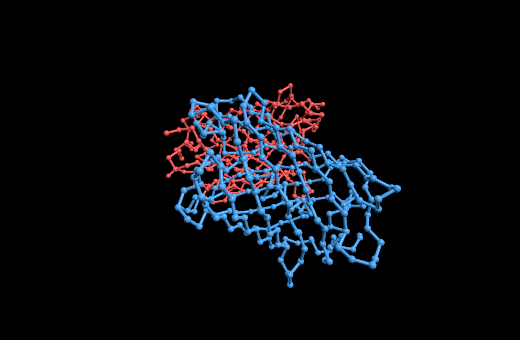
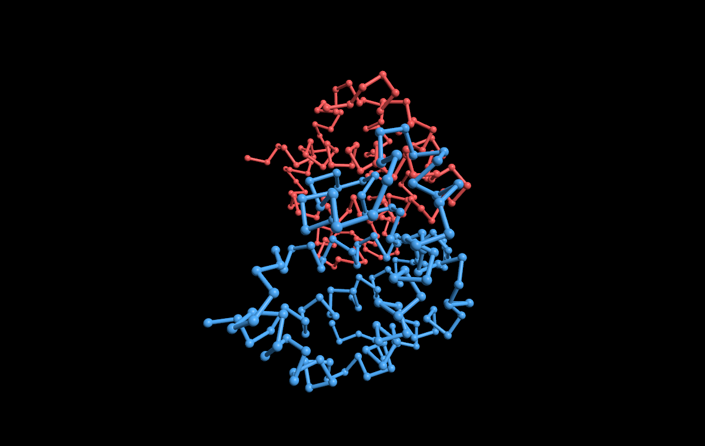
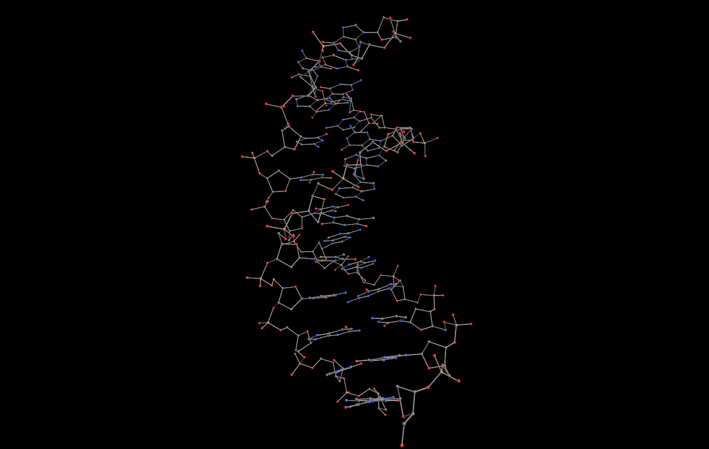
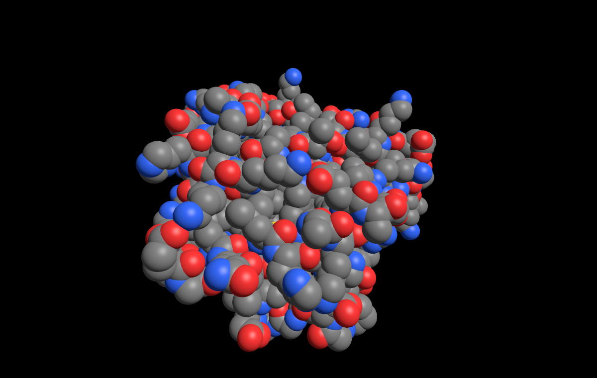
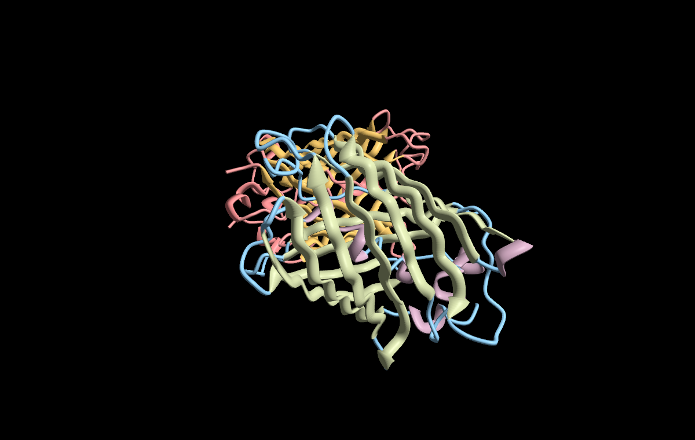
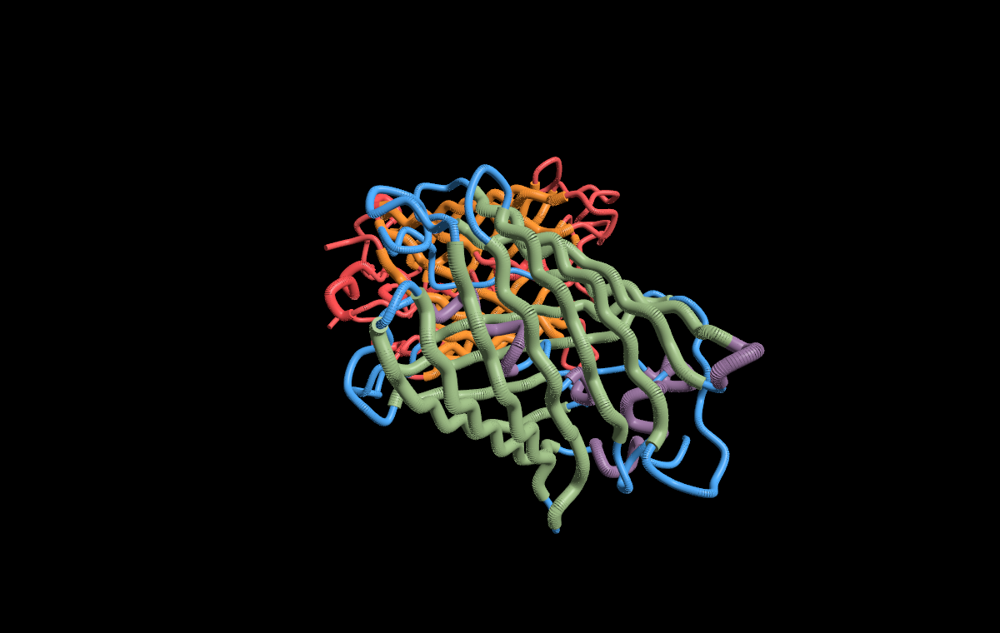

# Structure

A macOS screensaver that displays a random protein structure from the RCSB PDB,
rendered with SceneKit (Metal) and colored by chain.

Modern Swift re-implementation of [bblonder/structure](https://github.com/bblonder/structure)
— same idea, same name, updated for current macOS (Swift, SceneKit, `URLSession`,
sandboxed cache under `~/Library/Application Support`).



## Render modes

| | |
|---|---|
| **Backbone trace**<br>CA spheres + CA–CA cylinders, colored by chain | **Ball and stick**<br>All atoms (CPK colors) with distance-inferred bonds |
|  |  |
| **Spacefill (CPK)**<br>Van der Waals spheres in CPK colors | **Ribbon** (default)<br>Extruded ribbon mesh with PyMOL-style helix/sheet shapes |
|  |  |
| **Cartoon (tube)**<br>Catmull-Rom spline through CAs, helix/sheet thickening | |
|  | |

Modern macOS no longer shows the legacy in-saver "Options…" button, so the
render mode is **not** a runtime setting. Instead each mode ships as its own
installable saver, built side by side:

| Saver | Render mode |
|---|---|
| `Structure-Backbone.saver`  | Backbone trace |
| `Structure-BallStick.saver` | Ball and stick |
| `Structure-Spacefill.saver` | Spacefill (CPK) |
| `Structure-Ribbon.saver`    | Ribbon (extruded mesh) |
| `Structure-Cartoon.saver`   | Cartoon (tube) |

Install whichever you like — they appear as separate entries (e.g. "Structure
(Ribbon)") in System Settings and can coexist. The remaining settings (display
period, background color, cache, internet, info overlay) are shared across all
variants and are set via the standalone **Structure Settings** app or the
`structure-config` CLI.

## Build

You need `Resources/pdb_entry_type.txt` (the master list of all PDB IDs, ~5 MB).
Fetch it once:

```sh
curl -sSfL https://files.wwpdb.org/pub/pdb/derived_data/pdb_entry_type.txt \
    -o Resources/pdb_entry_type.txt
```

Then pick a build path. Both produce all four saver variants plus the
**Structure Settings** app.

### A. Command-line, no Xcode project

```sh
./build.sh
ls build/                       # Structure-Backbone.saver, …, Structure Settings.app
open build/Structure-Cartoon.saver
```

### B. XcodeGen → Xcode

```sh
brew install xcodegen
xcodegen
open Structure.xcodeproj
```

There is one target per variant (`StructureBackbone`, `StructureBallStick`,
`StructureSpacefill`, `StructureCartoon`) plus `StructureSettings`. Build a
target with **⌘B**, then in Finder right-click its `.saver` product
(under Products → *Show in Finder*) and double-click to install.

Each variant is the same shared code in `Sources/` plus a one-line subclass in
`Variants/<Mode>/PrincipalView.swift` that pins the render mode.

## Install

The first time you load an ad-hoc-signed screensaver, macOS may refuse with
"can't be opened because it is from an unidentified developer." Right-click
the `.saver` and choose **Open** to bypass once.

System Settings → Screen Saver → select the variant you installed (e.g.
**Structure (Cartoon)**) from the list.

The cache of downloaded `.pdb` files lives at
`~/Library/Application Support/Structure/cache/` (capped by the *Cache size*
setting, oldest-accessed evicted first). Under the
sandboxed `legacyScreenSaver` host, this maps to
`~/Library/Containers/com.apple.ScreenSaver.Engine.legacyScreenSaver/Data/Library/Application Support/Structure/cache/`.

## How it works

- `StructureView` (subclass of `ScreenSaverView`) hosts an `SCNView` and ticks
  at 30 fps. Every `DisplayPeriod` seconds it asks `PDBFetcher` for a new
  structure and crossfades it into the scene.
- `PDBFetcher` picks a random 4-letter ID from `pdb_entry_type.txt` (filtered
  to `prot` / `prot-nuc` entries) and fetches
  `https://files.rcsb.org/download/<ID>.pdb` via `URLSession`. Falls back to
  a bundled offline set (1mbn, 2dhb, 1bna, 1gfl, 1ytb, 2lyz, 1igt, 4ins) on
  any network failure or when *Only use local files* is enabled.
- `PDBParser` reads `ATOM`/`HETATM` records, header metadata
  (HEADER / TITLE / COMPND / SOURCE / EXPDTA / REMARK 2 / AUTHOR), and
  secondary structure (`HELIX` / `SHEET`) from the first MODEL.
- Renderer modules (`BackboneRenderer`, `BallStickRenderer`, `SpacefillRenderer`,
  `RibbonRenderer`) each build an `SCNNode` tree from a parsed structure.
- `InfoPanel` (an attributed `NSTextField`) overlays PDB ID + classification,
  title, authors, method + resolution, source organism, and a per-chain list
  with chain letters colored to match the rendering.

## Defaults

Stored via `ScreenSaverDefaults(forModuleWithName: "Structure")`:

- `DisplayPeriod` (Int, default 30) — seconds between structure swaps
- `CacheSize` (Int, default 100) — max on-disk cached PDB files
- `RenderMode` (Int 0-3, default 0) — used only by a generic build; the per-mode
  saver variants pin their mode and ignore this key
- `BackgroundColor` (String, default `#000000`) — scene background, `#RRGGBB`
- `EnableInternetAccess` (Bool, default true)
- `OnlyLoadLocalFiles` (Bool, default false)
- `FullTextualAnnotation` (Bool, default true)

## Media

The images and GIF above are rendered through the saver's own SceneKit
renderers (no external tools) from the bundled offline PDBs. Regenerate them with:

```sh
./Tools/make-media.sh   # writes media/ (still PNGs + structure.gif)
```
